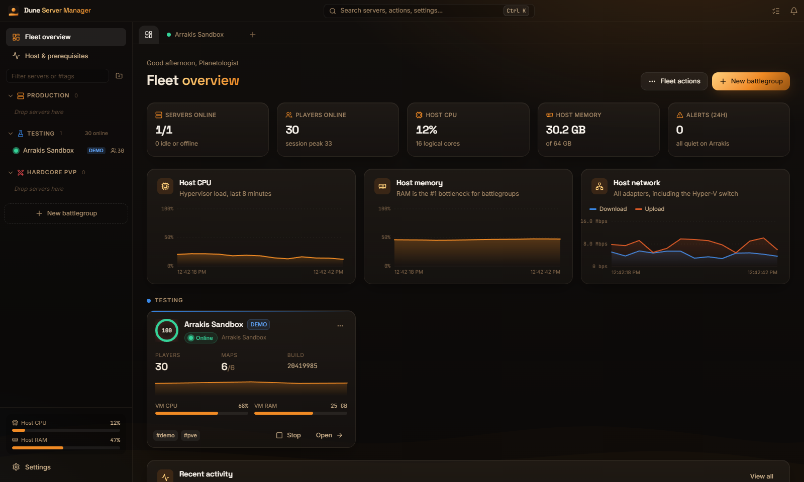
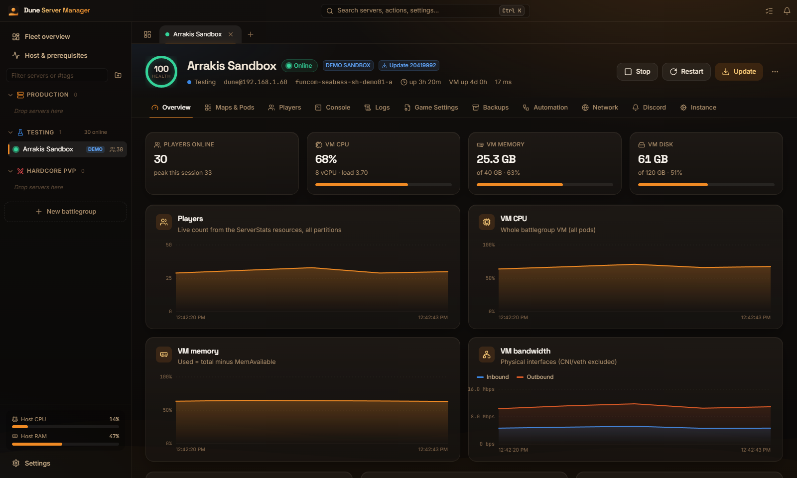
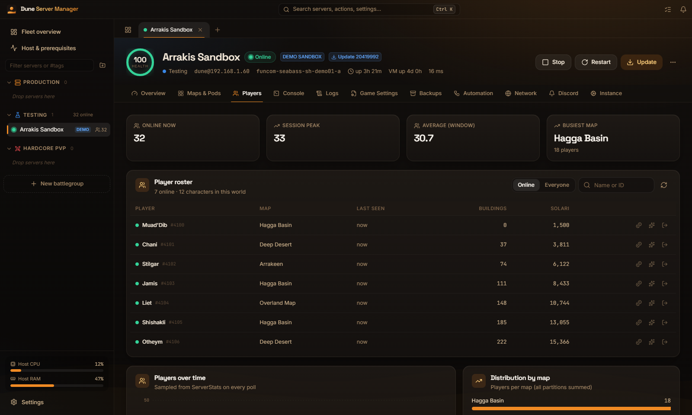
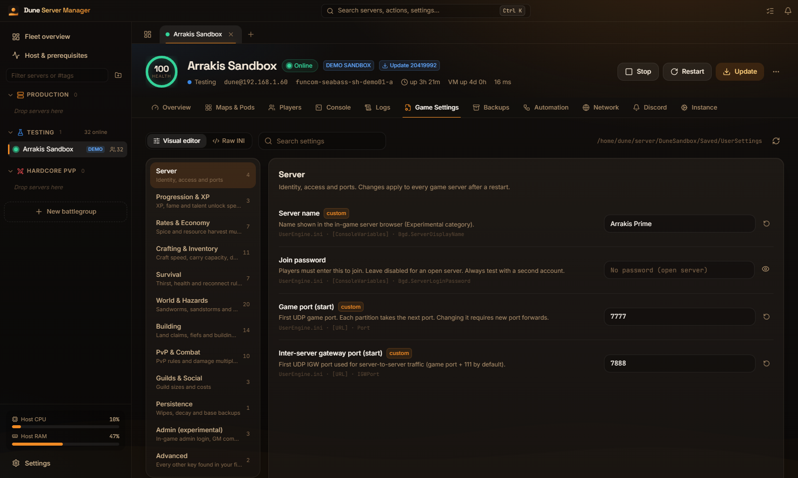
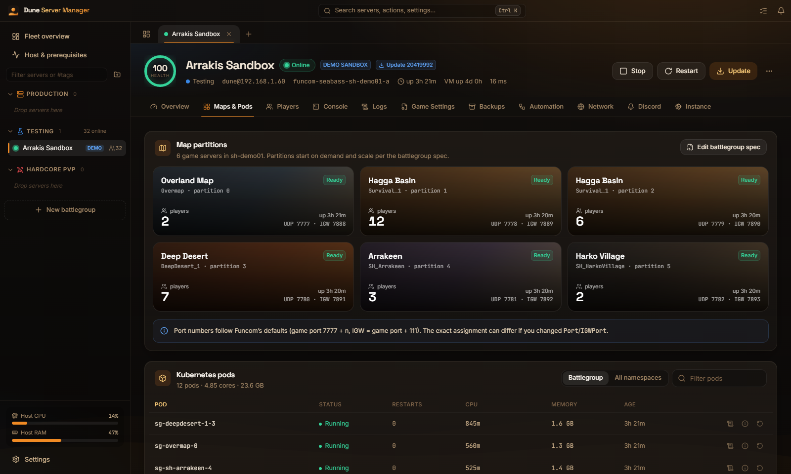
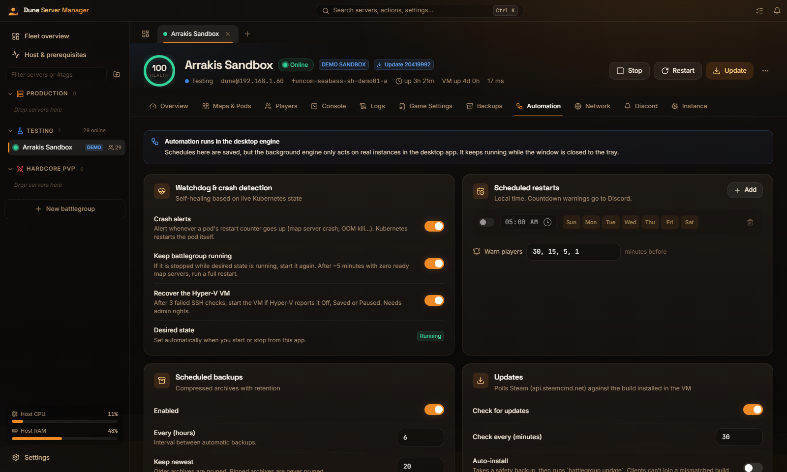
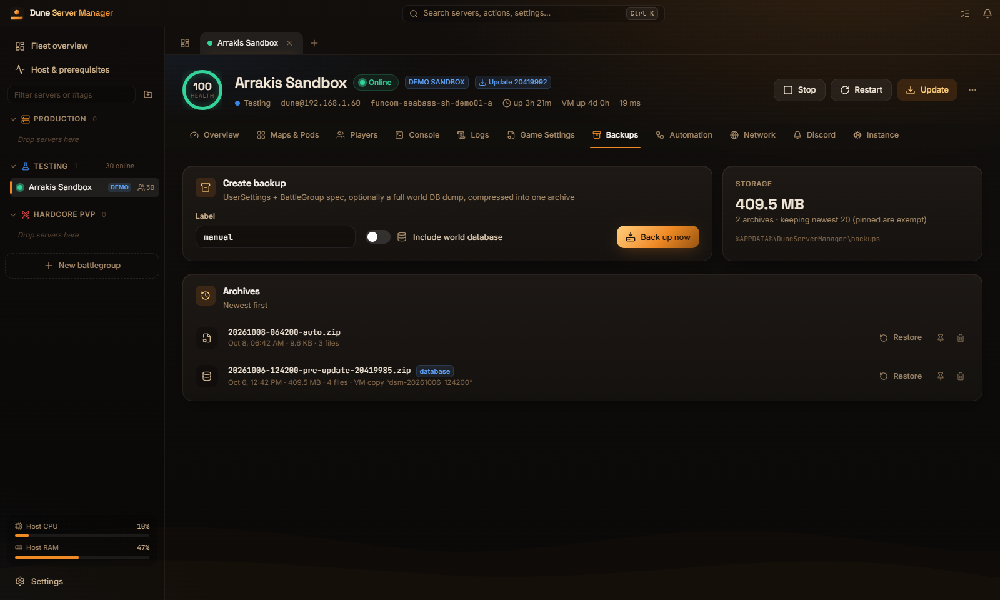
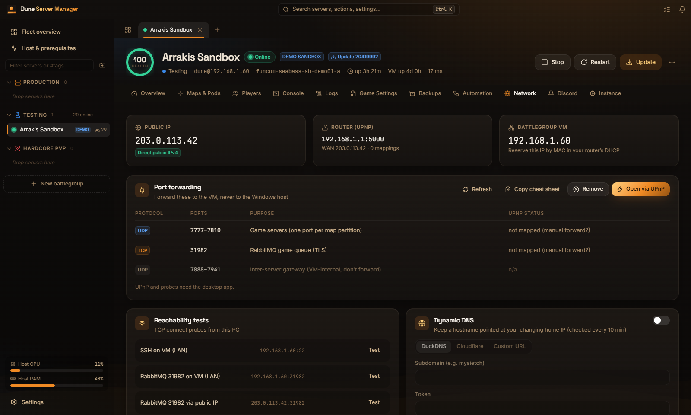
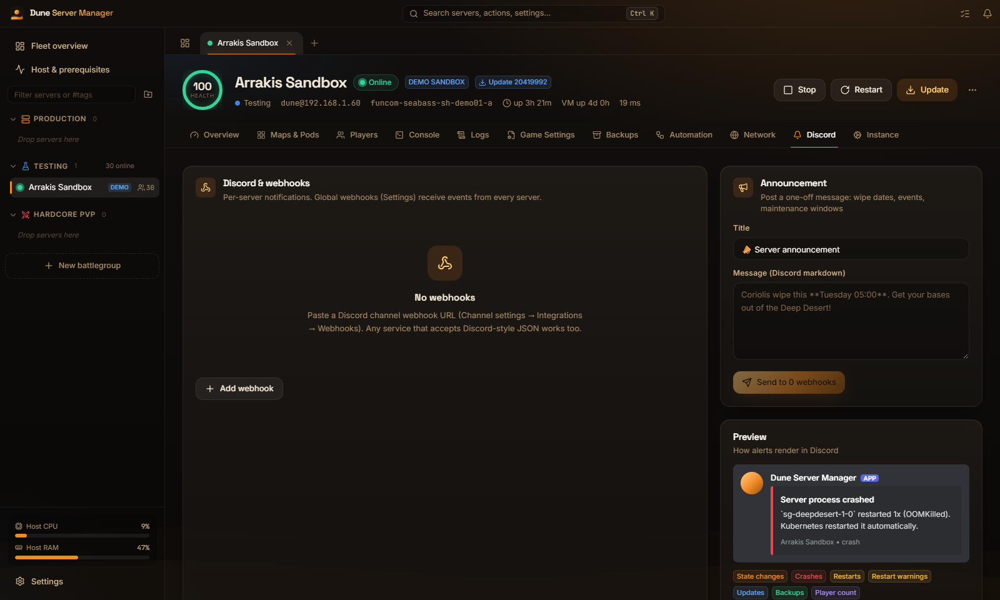

<div align="center">


# Dune Server Manager

**A desktop command center for Dune: Awakening self-hosted servers.**<br/>
Install, run, monitor, tune and automate your battlegroups from one window.

[](https://github.com/clawdroppin/Dune-Server-Manager/releases/latest)
[](https://github.com/clawdroppin/Dune-Server-Manager/releases)

[](LICENSE)

[**Download**](https://github.com/clawdroppin/Dune-Server-Manager/releases/latest) ·
[User guide](docs/USER_GUIDE.md) ·
[FAQ](#faq) ·
[Report a bug](https://github.com/clawdroppin/Dune-Server-Manager/issues/new/choose)



</div>

---

## Why

Funcom's self-hosted server is powerful but hard to run day to day. You get a Hyper-V virtual machine running Kubernetes, configuration files buried inside it, and an interactive batch menu. **Dune Server Manager** wraps all of that in one fast Windows app:

- **No Linux, kubectl or SSH knowledge needed** for everyday tasks.
- **It keeps working in the tray** while it's minimized: it restarts crashed servers, makes backups and pings Discord.
- **Nothing is hidden.** Long operations stream their live output to the Operations drawer, and every change is logged.

> [!NOTE]
> This is a **fan-made, unofficial** tool. It is not affiliated with or endorsed by Funcom. It uses Funcom's own self-host tooling and never modifies game files.

## Features

<table>
<tr>
<td width="50%" valign="top">

### 🖥️ Monitor
- **Fleet dashboard**: health score, players, maps, build and VM load for every server
- **Live graphs** for host and VM CPU, memory, disk and network
- **Maps & Pods**: every map partition with its player count, pod CPU/RAM and restart count
- **Live logs** from any game server
- **Player statistics**: online now, session peak, busiest map, players over time

</td>
<td width="50%" valign="top">

### 🎛️ Control
- **Start / stop / restart / update** with one click, or across a whole folder at once
- **Visual game-settings editor** with 80+ settings across 12 categories: XP, harvest rates, crafting, survival, sandworms, storms, building, PvP, guilds and more
- **Presets** (Vanilla, Boosted 3×, Casual PvE, Builder's paradise, Hardcore survival), a diff review before saving, and an automatic backup on the server
- **Raw INI** and **battlegroup YAML** editors for power users
- **Built-in console** (shell, kubectl, battlegroup CLI) with quick commands

</td>
</tr>
<tr>
<td valign="top">

### 👥 Players
- **Player roster** from the world database: online status, map, last seen, buildings and Solari
- **Kick**, **give Solari**, **award specialization XP**
- **SQL explorer** with ready-made queries (read-only by default)
- **Invite card** with your connection details, ready to share

</td>
<td valign="top">

### 🤖 Automate
- **Crash watchdog**: crash alerts, keeps the battlegroup running, and restarts the VM if it goes down
- **Scheduled restarts** with countdown warnings on Discord
- **Automatic backups** (settings and optionally the world database) with retention, pinning and restore
- **Steam update checks**, with optional auto-install after a safety backup
- **Maintenance mode** that pauses all automation
- **Discord webhooks** routed per event: state changes, crashes, restarts, warnings, updates, backups, players

</td>
</tr>
<tr>
<td valign="top">

### 🌐 Network
- **UPnP port mapping** straight to the VM
- **CGNAT detection** and reachability tests
- **Dynamic DNS**: DuckDNS, Cloudflare or a custom URL
- Port reference and security advice

</td>
<td valign="top">

### ✨ Quality of life
- **Setup wizard**: SteamCMD install, prerequisite checks, VM discovery, SSH key import
- **Tabs and folders** with drag & drop, colors, tags and favorites
- **Command palette** (<kbd>Ctrl</kbd>+<kbd>K</kbd>)
- **Minimize to tray**, start with Windows, desktop notifications
- **Demo sandbox**, so you can try everything without a server
- **Installer or portable**, your choice

</td>
</tr>
</table>

## Screenshots

| Server overview | Player roster |
|---|---|
|  |  |
| **Game settings editor** | **Maps & pods** |
|  |  |
| **Automation** | **Backups** |
|  |  |
| **Network** | **Discord** |
|  |  |

<sub>Screenshots show the built-in demo sandbox.</sub>

## Download

Get the latest version from the **[Releases page](https://github.com/clawdroppin/Dune-Server-Manager/releases/latest)**:

| File | Choose this if… |
|---|---|
| `Dune Server Manager_x.y.z_x64-setup.exe` | **Most people.** A normal installer with a Start-menu shortcut and an uninstaller. Settings are kept in `%APPDATA%\DuneServerManager`. |
| `DuneServerManager-x.y.z-Portable.zip` | You don't want to install anything. Extract it anywhere writable and run `Dune Server Manager.exe`. Everything stays in the `data` folder next to it. |
| `Dune Server Manager_x.y.z_x64_en-US.msi` | You deploy software with Group Policy or Intune. |

> [!TIP]
> Windows may show **"Windows protected your PC"** because the app isn't code-signed (signing certificates are expensive for a free hobby project). Click **More info → Run anyway**. You can check the download against the SHA-256 checksums published with every release.

## Requirements

**To try the app:** any Windows 10/11 PC. The built-in **demo sandbox** simulates a full server. WebView2 is required; it's built into Windows 11 and current Windows 10.

**To run a real Dune server** (Funcom's requirements):
- Windows 10/11 **Pro, Enterprise or Education** with **Hyper-V** enabled
- A CPU with **AVX2**, **20 GB+ RAM** (64 GB recommended), **100 GB+ free SSD space**
- A self-host token from **[account.duneawakening.com](https://account.duneawakening.com)**
- The **OpenSSH Client** Windows feature (installed by default on current Windows)
- **Run as administrator** for Hyper-V controls. Monitoring over SSH works without it.

## Quick start

1. **Download and open** the app.
2. Click **New battlegroup** and pick how to start:
   - **Fresh install**: downloads the server tool with SteamCMD, checks your PC, then opens Funcom's `battlegroup.bat` so you can create the VM with your token.
   - **Use existing install**: you already installed the tool from Steam (Library → Tools).
   - **Connect to running VM**: the VM already exists, on this PC or another one.
   - **Demo sandbox**: explore everything without a server.
3. The wizard finds the VM and imports its SSH key. Open the server to see live stats, change settings, add Discord and set up automation.

See the **[User guide](docs/USER_GUIDE.md)** for every screen in detail.

## FAQ

<details>
<summary><b>Does this replace Funcom's server tool?</b></summary>

No. It runs **on top of** Funcom's official tooling. The game server, VM and battlegroup are all Funcom's. The app drives them for you over SSH, PowerShell (Hyper-V) and SteamCMD.
</details>

<details>
<summary><b>Is there RCON or in-game admin commands?</b></summary>

Funcom hasn't released RCON or an admin API for self-hosted servers yet (they say it is planned). Until then, player management (roster, kick, Solari, XP) works by talking to the server's own database. These features are based on community research, so take a database backup before using write actions. Banning isn't possible yet; use a join password to keep people out.
</details>

<details>
<summary><b>Some settings are marked "community". What does that mean?</b></summary>

Funcom has documented only a few settings officially. Keys marked **community** were found by server owners and are used on community servers. They work in practice, but a game update could rename them. Any key the editor doesn't recognise is still shown under **Advanced**, so nothing is ever hidden or lost.
</details>

<details>
<summary><b>Will it work after a game update?</b></summary>

Usually, yes. When Funcom changes something big, [AGENTS.md](AGENTS.md) has a "Funcom changed X → edit Y" table that makes fixes quick. You can also hand that file to an AI assistant.
</details>

<details>
<summary><b>Where is my data? How do I uninstall cleanly?</b></summary>

- **Installer:** `%APPDATA%\DuneServerManager`. Uninstall from Windows Settings, then delete that folder if you want.
- **Portable:** everything is in the `data` folder next to the exe. Delete the folder and it's gone.

Your game server itself lives in Hyper-V and is never deleted by the app.
</details>

<details>
<summary><b>Does it send any data anywhere?</b></summary>

No telemetry and no accounts. The app only contacts what you set up: your server over SSH, Steam (for update checks), your Discord webhooks, your DDNS provider, and a public-IP lookup for the Network tab.
</details>

<details>
<summary><b>Can I run the installed and portable versions together?</b></summary>

No. Only one copy runs at a time, to stop two copies from running automation on the same server.
</details>

## Building from source

Requires **Node.js 20+** and **Rust** ([rustup](https://rustup.rs)) on Windows.

```bash
npm install
npm run dev          # UI only, in your browser, using the demo sandbox
npm run tauri dev    # the full desktop app with hot reload
npm run build:all    # installer (.exe + .msi) and portable .zip
```

Outputs are written to `src-tauri/target/release/bundle/` and `release/`. If PowerShell blocks `npm`, use `npm.cmd` instead.

The code is documented for contributors in **[AGENTS.md](AGENTS.md)** (file map, data flow, recipes) and **[docs/ARCHITECTURE.md](docs/ARCHITECTURE.md)** (design and research).

**Stack:** Tauri 2 · Rust · React 19 · TypeScript · Tailwind CSS 4 · Motion · Zustand

## Contributing

Bug reports, setting discoveries and pull requests are very welcome. See **[CONTRIBUTING.md](CONTRIBUTING.md)**. If you've found a working INI key that isn't in the editor yet, please open a *Setting discovery* issue.

## Credits

Made by **Jakub**. It wouldn't exist without the Dune self-hosting community. See **[CREDITS.md](CREDITS.md)** for everyone whose research, tools and libraries made it possible.

## License

[MIT](LICENSE). Free to use, share and modify.

<sub>Dune: Awakening is a trademark of Funcom. Dune is a trademark of Herbert Properties LLC. This project is not affiliated with, endorsed by or sponsored by Funcom, Legendary Entertainment or Herbert Properties.</sub>
